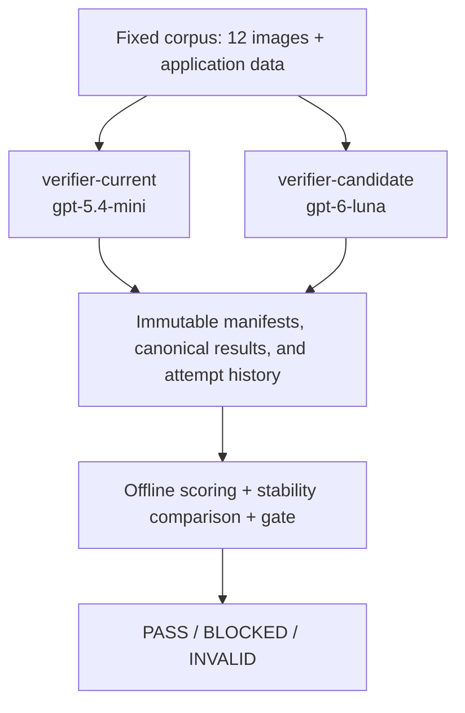

# AI Model Migration Gate

A migration gate evaluates whether an AI model can replace an existing model under a frozen behavioral and safety contract before deployment. This project evaluates beverage-label verification against a fixed synthetic image corpus, comparing **current `gpt-5.4-mini`** with **candidate `gpt-6-luna`** through two disposable local verifier clones.

Ad hoc prompt trials can miss regressions or obscure changes to evaluation inputs. This gate makes the contract explicit, preserves every attempt, and validates complete evidence before making a migration decision.

This is a controlled migration evaluation, not production shadow traffic or an online A/B test. The Python gate collects immutable evidence and evaluates saved runs offline.

> **Final saved migration decision: INVALID — exit code 2.**
>
> The official GPT-6 Luna candidate run remained incomplete after two `09-glare` extraction-service failures. The gate refused to produce aggregate scores or approve the migration.

**CI PASS != migration PASS.** A green CI run means the repository reproduces the committed experimental result correctly. It does not mean the candidate passed migration.

## Reproduce the saved result offline

Run these commands from the repository root after cloning. Python 3.14 matches the development and CI environment; the package requires Python 3.11 or newer. Installing dependencies may contact package registries. Tests and saved-result evaluation require no provider keys, verifier clones, or running servers.

```bash
python3.14 -m venv .venv
source .venv/bin/activate
python -m pip install ".[dev]"
```

Run the offline suite:

```bash
PYTHONDONTWRITEBYTECODE=1 \
PYTEST_ADDOPTS='-p no:cacheprovider' \
python -m pytest -q
```

Reproduce the final comparison-backed decision:

```bash
gate check \
  --target candidate \
  --run-id candidate-official-01 \
  --baseline-run-id current-baseline-01 \
  --baseline-run-id current-baseline-02 \
  --baseline-run-id current-baseline-03 \
  --json
```

**This command intentionally exits 2**, identifying `09-glare` in `scoring_problems.missing_case_ids`. Its JSON contains `decision: "INVALID"`, `metrics: null`, and `comparison: null`; every rule is `not_evaluated`. The nonzero status is the saved experimental result, not an installation failure.

To inspect a complete current baseline:

```bash
gate report --target current --run-id current-baseline-01 --json
```

`gate report` rejects the incomplete official candidate with exit 2 instead of emitting partial scored JSON. Relative `--cases` paths and `results/` resolve from the directory containing the selected `--config`, which defaults to `gate.yaml`.

## Decision contract

| Decision | Exit | Meaning |
|---|---:|---|
| PASS | 0 | Complete, trustworthy evidence exists and every frozen migration rule passes. |
| BLOCKED | 1 | Complete, trustworthy evidence exists, but one or more migration rules fail. |
| INVALID | 2 | Inputs, policy, or evidence cannot support a valid decision, including incomplete or structurally invalid runs. |

A final candidate decision requires exactly three distinct current baseline IDs. A check without baseline inputs evaluates absolute rules only and retains `comparison_required: true`; it is not final migration approval. The saved candidate check requests the final comparison, but incomplete candidate evidence prevents evaluating it.

## Architecture



The verifier applications are separate disposable local clones, outside this repository. The project does not deploy them. During measurement, the gate treats each verifier as a black-box HTTP API, posting image and application data to `/api/verify`. Both measured clones used verifier commit `92bef14aa05260a2c7f39aa104a5a202aea099ce`.

Collection validates selected cases, result paths, and the run fingerprint before constructing an HTTP client. Scoring and comparison consume saved evidence; they do not contact the verifiers. Pydantic models validate configuration, manifests, results, scores, and decisions, rejecting unknown fields.

## Frozen evaluation methodology

### Fixed corpus and scoring

[`cases/cases.jsonl`](cases/cases.jsonl) defines 12 synthetic beverage-label cases, their application data, expected outcomes, critical flags, and tags. The 12 PNG images are in [`cases/images/`](cases/images/).

| Coverage | Case IDs |
|---|---|
| Clean domestic and imported matches | `01-perfect`, `11-imported-pass` |
| Wrong ABV and net contents | `02-wrong-abv`, `03-wrong-volume` |
| Brand case-only variation | `04-brand-case-only` |
| Warning title case, changed wording, missing warning, and missing bold formatting | `05-warning-title-case` through `08-warning-not-bold` |
| Glare ambiguity and angled label | `09-glare`, `10-angled` |
| Country-of-origin mismatch | `12-country-mismatch` |

The scorer accepts only `raw_response.verification.overall.status` values `pass`, `needs_review`, and `fail`, mapping them to **Pass**, **Needs Review**, and **Fail**. Missing, malformed, or unknown statuses invalidate scoring.

| Expected \ Actual | Pass | Needs Review | Fail |
|---|---|---|---|
| Pass | correct | minor | false_block |
| Needs Review | dangerous | correct | false_block |
| Fail | dangerous | minor | correct |

Severity ranks are frozen: `correct = 0`, `minor = 1`, `false_block = 2`, `dangerous = 3`.

A **dangerous mistake** means a case expected to **Fail** or **Needs Review** is incorrectly returned as **Pass**. Cases marked `critical` have zero tolerance for dangerous mistakes.

Scoring requires one valid canonical successful result for every corpus case. It rejects unexpected root-level JSON files, invalid identities, corrupt results, and manifest/pin mismatches. Error attempts are retained as operational evidence and are never substituted for canonical results.

### Frozen release rules

[`gate.yaml`](gate.yaml) contains the policy frozen before candidate observation:

| Rule | Threshold | Evaluation |
|---|---:|---|
| `max_critical_dangerous_mistakes` | 0 | Critical dangerous count must be at most 0. |
| `min_correct_cases` | 10 | Correct count must be at least 10. |
| `max_slow_case_seconds` | 5.0 | Nearest-rank p95 client response time must be at most 5000 ms. |
| `max_dangerous_regressions` | 0 | Stable cases becoming candidate dangerous must be at most 0. |

Boundary equality passes. Median uses the standard definition, averaging the middle pair for an even sample. P95 uses the 1-based rank `ceil(0.95 * N)` without interpolation: for 12 cases, it is the slowest observation. Response times are measured by the gate client.

These thresholds were not adjusted in response to candidate behavior. An unset required correct-count threshold produces INVALID rather than defaulting to zero.

## Three current-model baselines

Three runs establish whether each current classification repeats across measurements:

| Committed run | Canonical successes | Correct | Minor | Median ms | P95 ms |
|---|---:|---:|---:|---:|---:|
| [current-baseline-01](results/current/current-baseline-01/) | 12 | 10 | 2 | 1678.460 | 3419.673 |
| [current-baseline-02](results/current/current-baseline-02/) | 12 | 10 | 2 | 1468.158 | 2688.779 |
| [current-baseline-03](results/current/current-baseline-03/) | 12 | 10 | 2 | 1553.857 | 2898.546 |

Each run had **0 false blocks, 0 dangerous mistakes, and 0 critical dangerous mistakes**, with 83.33% accuracy. The consistent minor cases were `04-brand-case-only` and `10-angled`: both expected Pass and returned Needs Review.

All **12 cases were stable** across all three runs; **0 were baseline-variable**. The correct-count threshold was derived by the frozen rule:

```text
min_correct_cases = min(10, 10, 10) = 10
```

### Stability-aware comparison

A case is `stable` only when all three current classifications are identical. Any mixture is `baseline_variable`, with no majority vote, best/worst reference, or averaged severity.

For a stable case, compare candidate severity with the stable current severity:

| Candidate rank | Comparison |
|---|---|
| Equal | `unchanged` |
| Lower | `got_better` |
| Higher | `got_worse` |

A **dangerous regression** requires a stable case that gets worse into candidate `dangerous`. Stable `dangerous` → `dangerous` is unchanged. A variable baseline → candidate `dangerous` is not a comparison regression, but still counts toward candidate dangerous totals and the absolute critical-dangerous rule.

Comparison JSON retains all three baseline run IDs in supplied order, alongside each case's classifications in that same order. Although this measured baseline had no variable cases, tests exercise mixed baselines. No candidate comparison was completed for the saved Luna run.

## Fingerprints and immutable storage

Each run is bound to a five-field identity:

| Field | Identity source |
|---|---|
| `declared_model` | Exact configured model declaration |
| `prompt_sha256` | Exact bytes of the verifier's `lib/label-extraction-prompt.ts` |
| `verifier_commit_sha` | Verifier Git revision, requiring a clean non-ignored working tree |
| `case_set_sha256` | Canonical case metadata, expectations, application data, tags, critical flags, and image hashes |
| `tool_version` | Gate package version |

Before confirmed collection or resume, the tool recomputes this identity and requires equality with the configured pin and existing manifest. Model, prompt, verifier, corpus, or tool drift cannot silently continue a run. The committed pins are in [`gate.yaml`](gate.yaml); the candidate identity is also recorded in its [manifest](results/candidate/candidate-official-01/manifest.json).

Offline scoring validates the manifest against the committed pin; it deliberately does **not** recompute identity or inspect verifier clones. The committed corpus, policy, pins, and saved records form the reproducible evaluation inputs. The manifest's timezone-aware UTC `created_at` is metadata, not fingerprint identity.

```text
results/<target>/<run_id>/
  manifest.json
  <case_id>.json
  attempts/<case_id>/
    0001.json
    0002.json
    ...
```

Manifest, canonical-result, and attempt files use exclusive creation. Every actual verifier attempt is saved first; the first successful HTTP verifier attempt then becomes the canonical result. **HTTP success is independent of the human outcome**: a canonical result may legitimately say Fail or Needs Review.

Failed attempts create no canonical result and remain retryable. Resuming skips valid canonical successes and appends new numbered attempts for incomplete cases. Existing successes are never replaced. Corrupt, mismatched, or non-success canonical files fail validation. `--force` is a developmental option, not part of the official evidence procedure; even forced attempts cannot replace canonical success.

## Saved GPT-6 Luna candidate evaluation

The committed official run is [`candidate-official-01`](results/candidate/candidate-official-01/).

| Fact | Saved value |
|---|---|
| Candidate model | `gpt-6-luna` |
| Initial provider attempts | 12 |
| Authorized retry attempts | 2 |
| Total provider attempts | 14 |
| Canonical successes | 11 |
| Attempt-history files | 14 |
| Total evidence files | 26: one manifest, 11 canonical results, 14 attempts |
| Incomplete case | `09-glare` |
| Final gate decision / exit | **INVALID / 2** |

Both retries used the same manifest-backed run. The 10 initial canonical successes remained untouched.

| Case | Attempt | HTTP | Result | Client response time |
|---|---|---:|---|---:|
| `09-glare` | `0001` | 502 | `EXTRACTION_SERVICE_ERROR` | 5039.546 ms |
| `09-glare` | `0002` | 502 | `EXTRACTION_SERVICE_ERROR` | 5893.745 ms |
| `11-imported-pass` | `0001` | 502 | `EXTRACTION_SERVICE_ERROR` | 5020.325 ms |
| `11-imported-pass` | `0002` | 200 | Success; actual **Pass** | 3459.657 ms |

`11-imported-pass` recovered and produced its canonical result. `09-glare` never did. Consequently, candidate aggregate metrics and comparison metrics were not produced, all four migration rules remained `not_evaluated`, and the gate returned INVALID. It did not invent an outcome for the missing case or score the successful subset as a complete run.

After the two `09-glare` failures, the evaluation was finalized as incomplete rather than repeatedly retried until a successful sample appeared. Keeping the unsuccessful attempts avoids cherry-picking and preserves the frozen experiment.

### Limitations

The evaluation covers 12 synthetic beverage-label cases and one project-specific verifier revision. It does not establish general model quality or production readiness. Two extraction-service failures do not establish that the candidate model is inherently unreliable; INVALID means the saved evidence cannot support a complete migration decision, not that a quality rule failed.

### Developmental smoke is separate

**DEVELOPMENTAL:** the local `candidate-smoke-01` integration test recorded `01-perfect`, HTTP 200, actual Pass, and 8760.657 ms. Developmental smoke runs are intentionally excluded from committed official evidence and scoring. They are not required to clone, test, or reproduce this repository's saved decision; no smoke result fills an official run's missing evidence.

## Offline CI and tests

[`.github/workflows/ci.yml`](.github/workflows/ci.yml) runs on push, pull request, and workflow dispatch. It uses Python 3.14, installs `.[dev]`, and runs the full pytest suite. Its saved-evidence assertion then:

1. Validates all three committed current baselines independently.
2. Confirms the candidate inventory and report rejection for missing canonical `09-glare`, with exit 2.
3. Executes the final check with the exact three baseline IDs and asserts INVALID / exit 2.
4. Requires null candidate metrics and comparison, exactly the expected missing-case problem, and `not_evaluated` rules with null actual values.

Unexpected PASS, BLOCKED, another INVALID cause, malformed JSON, or fabricated metrics fail CI. Provider-key variables are cleared. CI requires no provider credentials, installs no verifier dependencies, starts no verifier or Node server, and executes no live-run command. Dependency installation may use registry networking; the evaluation path is offline.

**Green CI = saved experiment reproduced correctly. Green CI != candidate approved for migration.** The workflow validates that distinction; it does not rename INVALID to PASS.

The current suite contains **628 tests**. CI requires all tests to pass, not a permanently fixed test count. Coverage includes fingerprint drift, manifest validation, exclusive writes, append-only retries, preflight ordering, strict outcome parsing, the full classification matrix, dangerous mistakes, latency boundaries, completeness, baseline stability, and final exit semantics. Comparison tests cover all 16 stable severity pairs and all 60 mixed three-run classification sequences, including variable cases that still trigger candidate critical-dangerous failures.

Behavioral tests use temporary saved runs, temporary verifier Git repositories where needed, and mocked HTTP transports. Network and secret-file guards protect offline tests. Permanent tests do not require local developmental smoke artifacts.

## Repository structure

```text
ai-model-migration-gate/
  .github/workflows/ci.yml
  cases/
    cases.jsonl
    images/                         # 12 synthetic PNGs
  src/ai_model_migration_gate/
    cli.py                          # Command presentation and exit handling
    cases.py, config.py             # Corpus and policy validation
    fingerprint.py, manifest.py     # Identity and run metadata
    runner.py, results.py           # Collection and immutable storage
    scoring.py, comparison.py       # Offline evaluation
    gate.py                         # Absolute and final decisions
  results/
    current/current-baseline-01/
    current/current-baseline-02/
    current/current-baseline-03/
    candidate/candidate-official-01/
  tests/
  gate.yaml
  pyproject.toml
  README.md
```

## Design decisions and runtime boundary

The implementation keeps evidence collection separate from evaluation. INVALID prevents incomplete evidence from masquerading as a release-rule result. Policy is frozen before candidate observation; fingerprints bind collection to its inputs; exclusive writes preserve the first success and every attempt. Stability uses three-run agreement instead of guessing a reference. Explicit dangerous-mistake semantics keep safety separate from overall accuracy. Offline CI and separate developmental evidence make the recorded decision reproducible.

### Optional live development

Future live collection is a separate development activity requiring a compatible verifier endpoint, provider credentials in that verifier's runtime, explicit confirmation and run ID, and a bounded call budget. It can consume API credit. The finalized candidate experiment should be reproduced from committed files, not rerun for a different sample.

### Security boundary

Offline scoring never needs provider secrets. Credentials belong to verifier runtime configuration; `.env.local` files are not part of this repository or its evidence. The gate's `.gitignore` excludes environment files and local credentials, and CI requires no provider keys.
