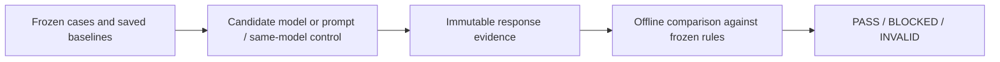
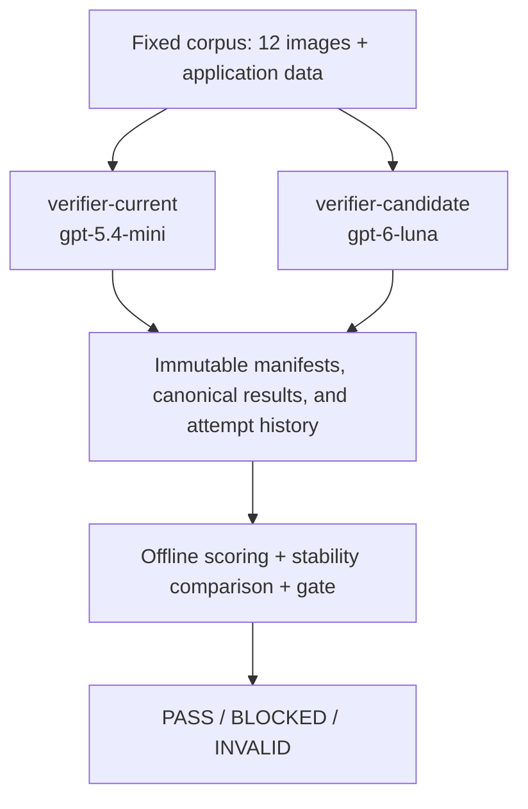

# AI Model Migration Gate

Before you switch AI models or change a prompt, this tool tells you whether the new one is safe, and blocks the release if it isn't.



| Result | Saved run | Complete cases | Correct | p95 client latency (ms) | Why |
|---|---|---:|---:|---:|---|
| INVALID | Original Luna run; Experiment 01 | 11/12; 7/12 | Not scored | Not scored | Missing canonical responses; no complete decision can be scored. |
| BLOCKED speed | Experiments 02; 03 (Luna) | 12/12; 12/12 | 10/12; 10/12 | 5639.530; 6884.823 | Both exceed 5000 ms; both have 0 critical dangerous mistakes and 0 dangerous regressions. |
| BLOCKED safety | Experiment 04 (GPT-4.1 Mini) | 12/12 | 9/12 | 4256.302 | 2 critical dangerous mistakes and 2 dangerous regressions; also below 10 correct. |
| BLOCKED accuracy | SAME-MODEL CONTROL control-01 | 12/12 | 9 of 12 | 2327.564 | Threshold 10, no noise margin; one previously correct case became a false block. This is not a migration. |
| PASS: none | No qualifying model migration | — | — | — | No migration PASS was achieved. |

Numbers above come from the committed [saved evidence catalog](experiments.json), raw result files and the unchanged gate output with all 3 original baselines. INVALID runs have no complete aggregate metrics. Green repository CI means these outcomes reproduce; it does not grant migration approval.

## What I learned

- With 12 cases, nearest-rank p95 equals the slowest case. A good median can still hide a release-blocking outlier.
- In the complete Luna runs (Experiments 02 and 03), Luna was safe under the frozen checks but slow: no observed dangerous mistakes or regressions, yet both exceeded the latency limit.
- GPT-4.1 Mini was fast but unsafe on this corpus: Experiment 04 met the latency limit and incorrectly passed critical warning/glare cases.
- A same-model control was blocked by one flipped case: `09-glare` changed from Needs Review (correct in all 3 baselines) to Fail (false block). The control reported the warning body as bold. Correct cases fell from the baseline threshold of 10 to 9, so the accuracy threshold has no noise margin. "Stable" meant stable across 3 runs; it did not guarantee the next response would agree.
- A larger case set and a threshold derived from more runs are future work. The existing thresholds, scoring and policy remain frozen.

**No migration PASS was achieved.** The project records reproducible rejection and incomplete-evidence outcomes; a same-model control is not a successful migration.

## Reproduce the saved result offline

Run these commands from the repository root after cloning. Python 3.14 matches the development and CI environment; the package requires Python 3.11 or newer. Installing dependencies may contact package registries. Tests and saved-result evaluation require no provider keys, verifier clones, or running servers.

```bash
python3.14 -m venv .venv
source .venv/bin/activate
python -m pip install ".[dev]"
```

Run historical validation and the offline suite:

```bash
PYTHONDONTWRITEBYTECODE=1 python scripts/evaluate_saved.py historical

PYTHONDONTWRITEBYTECODE=1 \
PYTEST_ADDOPTS='-p no:cacheprovider' \
python -m pytest -q
```

Reproduce the final comparison-backed decision:

```bash
gate check \
  --target candidate \
  --run-id candidate-official-01 \
  --baseline-run-id current-baseline-01 \
  --baseline-run-id current-baseline-02 \
  --baseline-run-id current-baseline-03 \
  --json
```

**This command intentionally exits 2**, identifying `09-glare` in `scoring_problems.missing_case_ids`. Its JSON contains `decision: "INVALID"`, `metrics: null`, and `comparison: null`; every rule is `not_evaluated`. The nonzero status is the saved experimental result, not an installation failure.

To inspect a complete current baseline:

```bash
gate report --target current --run-id current-baseline-01 --json
```

`gate report` rejects the incomplete official candidate with exit 2 instead of emitting partial scored JSON. Relative `--cases` paths and `results/` resolve from the directory containing the selected `--config`, which defaults to `gate.yaml`.

## Decision contract

| Decision | Exit | Meaning |
|---|---:|---|
| PASS | 0 | Complete, trustworthy evidence exists and every frozen migration rule passes. |
| BLOCKED | 1 | Complete, trustworthy evidence exists, but one or more migration rules fail. |
| INVALID | 2 | Inputs, policy, or evidence cannot support a valid decision, including incomplete or structurally invalid runs. |

A final candidate decision requires exactly three distinct current baseline IDs. A check without baseline inputs evaluates absolute rules only and retains `comparison_required: true`; it is not final migration approval. The saved candidate check requests the final comparison, but incomplete candidate evidence prevents evaluating it.

## Architecture



The verifier applications are separate disposable local clones, outside this repository. The project does not deploy them. During measurement, the gate treats each verifier as a black-box HTTP API, posting image and application data to `/api/verify`. The original current and Luna clones used verifier commit `92bef14aa05260a2c7f39aa104a5a202aea099ce`. Experiment 01 used the separately pinned checkout described below.

Collection validates selected cases, result paths, and the run fingerprint before constructing an HTTP client. Scoring and comparison consume saved evidence; they do not contact the verifiers. Pydantic models validate configuration, manifests, results, scores, and decisions, rejecting unknown fields.

## Frozen evaluation methodology

### Fixed corpus and scoring

[`cases/cases.jsonl`](cases/cases.jsonl) defines 12 fixed synthetic beverage-label cases, including eight safety-critical cases, their application data, expected outcomes, critical flags, and tags. The 12 PNG images are in [`cases/images/`](cases/images/).

| Coverage | Case IDs |
|---|---|
| Clean domestic and imported matches | `01-perfect`, `11-imported-pass` |
| Wrong ABV and net contents | `02-wrong-abv`, `03-wrong-volume` |
| Brand case-only variation | `04-brand-case-only` |
| Warning title case, changed wording, missing warning, and missing bold formatting | `05-warning-title-case` through `08-warning-not-bold` |
| Glare ambiguity and angled label | `09-glare`, `10-angled` |
| Country-of-origin mismatch | `12-country-mismatch` |

The scorer accepts only `raw_response.verification.overall.status` values `pass`, `needs_review`, and `fail`, mapping them to **Pass**, **Needs Review**, and **Fail**. Missing, malformed, or unknown statuses invalidate scoring.

| Expected \ Actual | Pass | Needs Review | Fail |
|---|---|---|---|
| Pass | correct | minor | false_block |
| Needs Review | dangerous | correct | false_block |
| Fail | dangerous | minor | correct |

The frozen **Expected Needs Review + Actual Fail = `false_block`** classification is retained, including its documented difference from the original brief.

Severity ranks are frozen: `correct = 0`, `minor = 1`, `false_block = 2`, `dangerous = 3`.

A **dangerous mistake** means a case expected to **Fail** or **Needs Review** is incorrectly returned as **Pass**. Cases marked `critical` have zero tolerance for dangerous mistakes.

Scoring requires one valid canonical successful result for every corpus case. It rejects unexpected root-level JSON files, invalid identities, corrupt results, and manifest/pin mismatches. Error attempts are retained as operational evidence and are never substituted for canonical results.

### Frozen release rules

[`gate.yaml`](gate.yaml) contains the policy frozen before candidate observation:

| Rule | Threshold | Evaluation |
|---|---:|---|
| `max_critical_dangerous_mistakes` | 0 | Critical dangerous count must be at most 0. |
| `min_correct_cases` | 10 | Correct count must be at least 10. |
| `max_slow_case_seconds` | 5.0 | Nearest-rank p95 client response time must be at most 5000 ms. |
| `max_dangerous_regressions` | 0 | Stable cases becoming candidate dangerous must be at most 0. |

Boundary equality passes. Median uses the standard definition, averaging the middle pair for an even sample. P95 uses the 1-based rank `ceil(0.95 * N)` without interpolation: for 12 cases, it is the slowest observation. Response times are measured by the gate client.

These thresholds were not adjusted in response to candidate behavior. An unset required correct-count threshold produces INVALID rather than defaulting to zero.

## Three current-model baselines

Three runs establish whether each current classification repeats across measurements:

| Committed run | Canonical successes | Correct | Minor | Median ms | P95 ms |
|---|---:|---:|---:|---:|---:|
| [current-baseline-01](results/current/current-baseline-01/) | 12 | 10 | 2 | 1678.460 | 3419.673 |
| [current-baseline-02](results/current/current-baseline-02/) | 12 | 10 | 2 | 1468.158 | 2688.779 |
| [current-baseline-03](results/current/current-baseline-03/) | 12 | 10 | 2 | 1553.857 | 2898.546 |

Each run had **0 false blocks, 0 dangerous mistakes, and 0 critical dangerous mistakes**, with 83.33% accuracy. The consistent minor cases were `04-brand-case-only` and `10-angled`: both expected Pass and returned Needs Review.

All **12 cases were stable** across all three runs; **0 were baseline-variable**. The correct-count threshold was derived by the frozen rule:

```text
min_correct_cases = min(10, 10, 10) = 10
```

### Stability-aware comparison

A case is `stable` only when all three current classifications are identical. Any mixture is `baseline_variable`, with no majority vote, best/worst reference, or averaged severity.

For a stable case, compare candidate severity with the stable current severity:

| Candidate rank | Comparison |
|---|---|
| Equal | `unchanged` |
| Lower | `got_better` |
| Higher | `got_worse` |

A **dangerous regression** requires a stable case that gets worse into candidate `dangerous`. Stable `dangerous` → `dangerous` is unchanged. A variable baseline → candidate `dangerous` is not a comparison regression, but still counts toward candidate dangerous totals and the absolute critical-dangerous rule.

Comparison JSON retains all three baseline run IDs in supplied order, alongside each case's classifications in that same order. Although this measured baseline had no variable cases, tests exercise mixed baselines. No candidate comparison was completed for the saved Luna run.

## Fingerprints and immutable storage

Each run is bound to a five-field identity:

| Field | Identity source |
|---|---|
| `declared_model` | Exact configured model declaration |
| `prompt_sha256` | Exact bytes of the verifier's `lib/label-extraction-prompt.ts` |
| `verifier_commit_sha` | Verifier Git revision, requiring a clean non-ignored working tree |
| `case_set_sha256` | Canonical case metadata, expectations, application data, tags, critical flags, and image hashes |
| `tool_version` | Gate package version |

Before confirmed collection or resume, the tool recomputes this identity and requires equality with the configured pin and existing manifest. Model, prompt, verifier, corpus, or tool drift cannot silently continue a run. The committed pins are in [`gate.yaml`](gate.yaml); the candidate identity is also recorded in its [manifest](results/candidate/candidate-official-01/manifest.json).

Offline scoring validates the manifest against the committed pin; it deliberately does **not** recompute identity or inspect verifier clones. The committed corpus, policy, pins, and saved records form the reproducible evaluation inputs. The manifest's timezone-aware UTC `created_at` is metadata, not fingerprint identity.

```text
results/<target>/<run_id>/
  manifest.json
  <case_id>.json
  attempts/<case_id>/
    0001.json
    0002.json
    ...
```

Manifest, canonical-result, and attempt files use exclusive creation. Every actual verifier attempt is saved first; the first successful HTTP verifier attempt then becomes the canonical result. **HTTP success is independent of the human outcome**: a canonical result may legitimately say Fail or Needs Review.

Failed attempts create no canonical result and remain retryable. Resuming skips valid canonical successes and appends new numbered attempts for incomplete cases. Existing successes are never replaced. Corrupt, mismatched, or non-success canonical files fail validation. `--force` is a developmental option, not part of the official evidence procedure; even forced attempts cannot replace canonical success.

## Saved GPT-6 Luna candidate evaluation

The committed official run is [`candidate-official-01`](results/candidate/candidate-official-01/).

| Fact | Saved value |
|---|---|
| Candidate model | `gpt-6-luna` |
| Initial gate attempts | 12 |
| Authorized retry attempts | 2 |
| Total gate attempts | 14 |
| Canonical successes | 11 |
| Attempt-history files | 14 |
| Total evidence files | 26: one manifest, 11 canonical results, 14 attempts |
| Incomplete case | `09-glare` |
| Final gate decision / exit | **INVALID / 2** |

Both retries used the same manifest-backed run. The 10 initial canonical successes remained untouched.

| Case | Attempt | HTTP | Result | Client response time |
|---|---|---:|---|---:|
| `09-glare` | `0001` | 502 | `EXTRACTION_SERVICE_ERROR` | 5039.546 ms |
| `09-glare` | `0002` | 502 | `EXTRACTION_SERVICE_ERROR` | 5893.745 ms |
| `11-imported-pass` | `0001` | 502 | `EXTRACTION_SERVICE_ERROR` | 5020.325 ms |
| `11-imported-pass` | `0002` | 200 | Success; actual **Pass** | 3459.657 ms |

`11-imported-pass` recovered and produced its canonical result. `09-glare` never did. Consequently, candidate aggregate metrics and comparison metrics were not produced, all four migration rules remained `not_evaluated`, and the gate returned INVALID. It did not invent an outcome for the missing case or score the successful subset as a complete run.

After the two `09-glare` failures, the evaluation was finalized as incomplete rather than repeatedly retried until a successful sample appeared. Keeping the unsuccessful attempts avoids cherry-picking and preserves the frozen experiment.

### Limitations

The evaluation covers 12 synthetic beverage-label cases and one project-specific verifier revision. It does not establish general model quality or production readiness. Two extraction-service failures do not establish that the candidate model is inherently unreliable; INVALID means the saved evidence cannot support a complete migration decision, not that a quality rule failed.

### Developmental smoke is separate

**DEVELOPMENTAL:** the local `candidate-smoke-01` integration test recorded `01-perfect`, HTTP 200, actual Pass, and 8760.657 ms. Developmental smoke runs are intentionally excluded from committed official evidence and scoring. They are not required to clone, test, or reproduce this repository's saved decision; no smoke result fills an official run's missing evidence.

## Experiment 01: local measured findings

Experiment `experiment-01` used [`gate.experiment-01.yaml`](gate.experiment-01.yaml), model `gpt-5.6-luna`, and verifier commit `3e9498e71461cc38cdc5caf7fc140e09914a9c82`. Its [preregistration](experiments/experiment-01/preregistration.md) and [source patch](experiments/experiment-01/verifier.patch) were committed before observation. The preregistration remains an immutable pre-observation record marked NOT RUN; this section records the later observation.

The only verifier source change added `max_output_tokens: 8192`. Prompt, structured-output schema, image detail, 5000-ms OpenAI SDK timeout, zero automatic SDK retries, and downstream verification logic were unchanged. No explicit reasoning parameter was supplied. This compares a model **and a specified output-token policy**, so it does not establish pure model-only causality. Source fingerprints bind declared identity; they cannot independently prove which provider actually executed a request.

| Case | HTTP | Saved classification | Client time ms |
|---|---:|---|---:|
| `01-perfect` | 200 | correct | 4525.636 |
| `02-wrong-abv` | 502 | unscored error | 5074.695 |
| `03-wrong-volume` | 502 | unscored error | 5281.064 |
| `04-brand-case-only` | 200 | minor | 4429.937 |
| `05-warning-title-case` | 200 | correct | 4943.452 |
| `06-warning-word-changed` | 200 | correct | 4122.833 |
| `07-warning-missing` | 200 | correct | 3431.445 |
| `08-warning-not-bold` | 200 | correct | 3717.334 |
| `09-glare` | 502 | unscored error | 5033.039 |
| `10-angled` | 502 | unscored error | 5051.924 |
| `11-imported-pass` | 502 | unscored error | 5038.247 |
| `12-country-mismatch` | 200 | correct | 4692.464 |

All five HTTP 502 attempts contain `EXTRACTION_SERVICE_ERROR`. There were **12 first-pass attempts, 12 completed reservations, 7 canonical successes, and no retries**. Missing canonical cases are `02-wrong-abv`, `03-wrong-volume`, `09-glare`, `10-angled`, and `11-imported-pass`. The real offline check returned **INVALID / 2**, with null metrics and comparison and all four rules `not_evaluated`. The successful subset is not a complete candidate score. Times near the SDK timeout do not by themselves prove the provider failure's root cause; the gate measures the full client HTTP request.

**Evidence availability:** Experiment 01 result files and accounting files remain local and untracked. The catalog now records the verified outcomes of Experiments 01–03, but a fresh clone lacks their raw evidence and catalog validation fails closed. No release selector or outcome-labeled candidate configuration has been created.

On the original workspace containing that saved run, inspect its decision offline:

```bash
gate check --config gate.experiment-01.yaml --target candidate --run-id experiment-01 \
  --baseline-run-id current-baseline-01 \
  --baseline-run-id current-baseline-02 \
  --baseline-run-id current-baseline-03 --json
```

This intentionally exits 2. Original baselines, Luna evidence, corpus, thresholds and classifications remain unchanged. Genuine comparison-backed BLOCKED evidence is now available from Experiments 02 and 03; a genuine migration PASS remains an acceptance gap.

## Experiments 02 and 03: complete BLOCKED evidence

Both runs used `gpt-5.6-luna`, a 20-second SDK timeout, zero SDK retries and an 8192 output cap. Experiment 02 explicitly used low reasoning; Experiment 03 changed only reasoning effort to none. Both retained the frozen prompt, schema, verification logic, corpus and five-second acceptance rule.

| Run | Canonical successes | Correct | Median ms | P95 ms | Decision |
|---|---:|---:|---:|---:|---|
| experiment-02 | 12 | 10 | 3822.048 | 5639.530 | BLOCKED / 1 |
| experiment-03 | 12 | 10 | 2848.239 | 6884.823 | BLOCKED / 1 |

Each run made twelve first-pass dispatches, with no retries or HTTP errors. All accuracy and safety rules passed; only latency failed. Every slow or incorrect canonical response remains preserved. The [audit](experiments/evidence-audit.md) records pins, evidence hashes and independent verification of both genuine outcomes through the unchanged release evaluator using temporary byte-identical evidence views.

## Historical CI, release CI and tests

[`.github/workflows/ci.yml`](.github/workflows/ci.yml) runs the full offline suite and `python scripts/evaluate_saved.py historical` on push, pull request and manual dispatch. Historical mode independently validates all three baselines and reproduces the original Luna's exact missing-`09-glare` INVALID cause, null metrics/comparison, and unevaluated rules. The catalog additionally requires Experiments 01–03 to reproduce their recorded INVALID/2, BLOCKED/1 and BLOCKED/1 decisions and evidence hashes. Unexpected decisions, changed evidence or malformed inputs fail validation. These checks pass in the evidence-bearing workspace; a fresh clone fails closed because the metadata-only commit excludes local experiment raw evidence.

[`.github/workflows/release.yml`](.github/workflows/release.yml) evaluates the selected release on pushes and pull requests when `release.json` exists in the checked-out revision **or its base revision**. Deleting a selector therefore fails closed. Manual dispatch always requests release evaluation, even if the selector is missing. With no selector in either revision, automatic CI explicitly reports that no release approval was evaluated; its green status does not approve a migration.

An activated release check runs this command directly, without swallowing nonzero exits:

```bash
PYTHONDONTWRITEBYTECODE=1 python scripts/evaluate_saved.py release
```

| Selected release outcome | Helper exit | Release CI |
|---|---:|---|
| Complete comparison-backed PASS | 0 | Successful check |
| Complete comparison-backed BLOCKED | 1 | Failing check |
| INVALID, missing selector, or unapproved inputs | 2 | Failing check |

The helper requires a regular root-level `release.json` containing exactly `config` and `run_id`, an exact official pair in reviewed `experiments.json`, an approved root-level `gate.pass.yaml` or `gate.blocked.yaml`, matching evidence digests/pins, the actual frozen corpus, and all three complete baselines. PASS requires all 12 canonical cases, a final evaluated comparison, and evaluated frozen rules. It rejects unsafe paths, symlinks, duplicate keys, smoke evidence, missing data and unregistered pairs. It never substitutes another run. **The repository now has a verified catalog but no release selector: direct/manual root release evaluation still fails closed with exit 2.** Do not create a selector using invented identities or observations.

Provider-key variables are cleared in both workflows. Neither starts verifiers, installs verifier dependencies, or collects model observations. GitHub checkout and dependency installation can use networking; evaluation itself consumes saved files offline. These workflows have been tested locally; they have not been pushed or exercised on GitHub as part of this work.

**Green historical CI means expected history reproduced. A skipped release evaluation is not PASS.** Synthetic PASS/BLOCKED/INVALID fixtures in temporary test projects verify program and CI-shell exit behavior; they are not genuine model results and are never added to official evidence. Tests also cover fingerprint drift, raw configuration invariants, immutable attempts, malformed outcomes, latency boundaries, baseline stability, strict release selection and session accounting.

## Repository structure

```text
ai-model-migration-gate/
  .github/workflows/ci.yml
  .github/workflows/release.yml
  scripts/
    evaluate_saved.py               # Historical expectations / selected release
    controlled_experiment.py        # Local accounting and bounded collection
  experiments/experiment-01/
    preregistration.md
    verifier.patch
  cases/
    cases.jsonl
    images/                         # 12 synthetic PNGs
  src/ai_model_migration_gate/
    cli.py                          # Command presentation and exit handling
    cases.py, config.py             # Corpus and policy validation
    fingerprint.py, manifest.py     # Identity and run metadata
    runner.py, results.py           # Collection and immutable storage
    scoring.py, comparison.py       # Offline evaluation
    gate.py                         # Absolute and final decisions
  results/
    current/current-baseline-01/
    current/current-baseline-02/
    current/current-baseline-03/
    candidate/candidate-official-01/
  tests/
  gate.yaml
  gate.experiment-01.yaml
  pyproject.toml
  README.md
```

## Design decisions and runtime boundary

The implementation keeps evidence collection separate from evaluation. INVALID prevents incomplete evidence from masquerading as a release-rule result. Policy is frozen before candidate observation; fingerprints bind collection to its inputs; exclusive writes preserve the first success and every attempt. Stability uses three-run agreement instead of guessing a reference. Explicit dangerous-mistake semantics keep safety separate from overall accuracy. Offline CI and separate developmental evidence make the recorded decision reproducible.

### Optional live development

Future live collection is a separate development activity requiring a compatible verifier endpoint, provider credentials in that verifier's runtime, explicit confirmation and run ID, and a bounded call budget. It can consume API credit. The original candidate experiment should be reproduced from committed files, not rerun for a different sample. With the pinned isolated checkout available locally, `python scripts/controlled_experiment.py status` is read-only. Session collection requires `session --allow-live --budget 0.50` and one explicit terminal charge acknowledgement; it never starts a verifier or inspects credentials. It durably reserves each request before dispatch, holds a Linux file lock, skips attempted first-pass cases, and preserves saved HTTP errors without retrying them. Unresolved reservations, transport failures, corruption and budget violations stop collection. All twelve Experiment 01 first-pass cases have already been attempted, so its session refuses additional first-pass collection.

The local $0.50 reservation budget is not a provider-side billing cutoff. Conditional pricing version 2 reserves $0.0213304 per future attempt and conservatively reprices the original $0.0190304 reservation for headroom. Experiment 01's recorded total is $0.2536648 and its conservatively reserved exposure is $0.2559648. These are estimates, not observed charges. The controller cannot verify prepaid balance, provider attribution or actual billing; the operator must interrupt on known unexpected costs or runtime changes.

### Security boundary

Offline scoring never needs provider secrets. Credentials belong to verifier runtime configuration; `.env.local` files are not part of this repository or its evidence. The gate's `.gitignore` excludes environment files and local credentials, and CI requires no provider keys.

Policy, validator code, pins, catalog and evidence share repository trust. These checks are consistency controls, not an independent security boundary. Protected policy/workflows and separately trusted validation would be required for a stronger deployment boundary.
